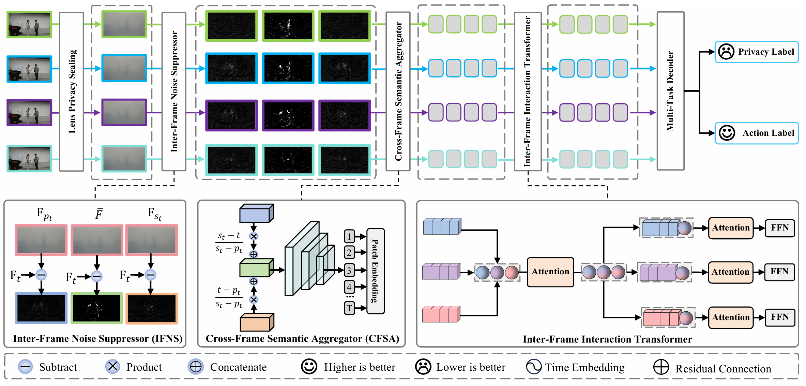

# Benchmarking Physical Privacy-Preserving Action Recognition: An Embarrassingly Simple Device, Dataset, and Method

## Introduction

The wide spread of RGB camera-based surveillance systems has advanced public safety, smart homes, and intelligent healthcare. However, it has also raised serious privacy concerns, particularly in the field of human action recognition. Existing privacy-preserving approaches typically rely on post-capture algorithms, which fail to address privacy risks during data acquisition, leaving devices vulnerable to unauthorized access or tampering. To address this gap, we propose a physical solution designed to enhance privacy protection during data capture and establish a benchmark for privacy-preserving action recognition through a new device, dataset, and method. First, we introduce Lens Privacy Sealing (LPS), a simple and cost-effective approach that uses commonly available laminating film to physically obscure the camera lens. This method reduces privacy risk during data capture with minimal hardware modifications. Next, a new dataset of $P^3AR$ is presented, designed for the recognition of privacy-preserving actions. This dataset poses a unique challenge due to the degradation of video quality caused by the LPS intervention. Traditional human action recognition methods typically follow a two-stage process. However, in degraded videos, human detection becomes particularly challenging due to the blurring and attenuation of critical details. In contrast, we propose a single-stage architecture called the Motion Semantic Prompting Network (MSPNet), which directly performs human action recognition on degraded videos, introducing two key components: a Cross-Frame Semantic Aggregator and an Inter-Frame Noise Suppression module. These innovations eliminate the need for the traditional human detection step while enhancing both privacy protection and recognition accuracy. Additionally, MSPNet integrates a language-image pre-training model and transformers to optimize spatio-temporal integration for privacy-preserving action recognition. Extensive experiments on the proposed $P^3AR$ dataset demonstrate that MSPNet effectively protects privacy while maintaining competitive recognition accuracy, establishing a strong baseline of privacy-preserving action recognition.



## Installation

To set up the environment, follow the steps below:

```bash
conda create -n MSPNet python=3.7
conda activate MSPNet
pip install -r requirements.txt
```

To install Apex, use the following commands:

```bash
git clone https://github.com/NVIDIA/apex
cd apex
pip install -v --disable-pip-version-check --no-cache-dir --global-option="--cpp_ext" --global-option="--cuda_ext" ./
```

We provide the complete environment configuration in `requirements.yml` for your reference.

---

## Datasets

Please refer to our [repository](https://github.com/adventurer-w/P3AR-NTU) for instructions on downloading and preprocessing the P$^3$AR-NTU dataset.

---

## Training

To train the MSPNet model on the P$^3$AR-NTU dataset using 4 GPUs, execute the following command:

```bash
python -m torch.distributed.launch --nproc_per_node=4 --master_port=25658 ntu_main.py \
    --config configs/NTU/NTU120_XSet.yaml \
    --distributed True \
    --accumulation-steps 2 \
    --output output/ntu_encrypted
```

### Notes:

- If your system has limited GPU memory or fewer GPUs, you can adjust the `--accumulation-steps` parameter to maintain the overall batch size.
- Configuration files are located in the `configs` directory. Ensure that the correct dataset path is specified in the configuration.

### Pretrained CLIP Model:

The pretrained CLIP model will be automatically downloaded. Alternatively, you can manually specify the path using the following option:

```bash
--pretrained /PATH/TO/PRETRAINED
```

---

## Testing

To test the MSPNet model on the P$^3$AR-NTU dataset using 4 GPUs, execute the following command:

```bash
python -m torch.distributed.launch --nproc_per_node=4 --master_port=25658 ntu_main.py \
    --config configs/NTU/NTU120_XSet.yaml \
    --resume /PATH/TO/CKPT \
    --output output/ntu_encrypted \
    --only_test True
```
