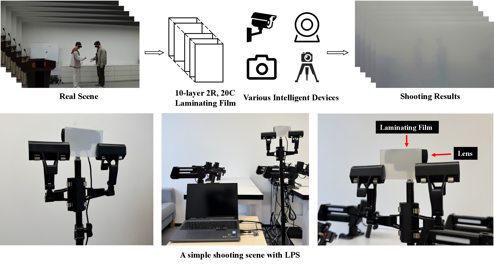
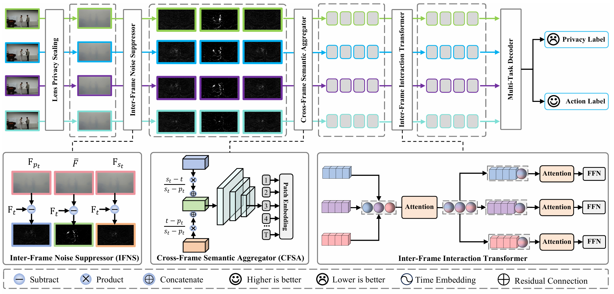

<h1 align="center">Lens Privacy Sealing: A New Benchmark and Method for Physical Privacy-Preserving Action Recognition</h1>

<p align="center">
  <a href="https://scholar.google.com/citations?hl=zh-CN&user=woX_4AcAAAAJ">Mengyuan Liu</a>,
  <a href="https://wangzy01.github.io/">Ziyi Wang</a><sup>&dagger;</sup>,
  <a href="https://scholar.google.com/citations?user=TFBbgIQAAAAJ&hl=zh-CN">Peiming Li</a><sup>&dagger;</sup>,
  <a href="https://scholar.google.com/citations?user=fJ7seq0AAAAJ&hl=zh-CN">Junsong Yuan</a>
</p>

<p align="center">
  Peking University Shenzhen Graduate School, State University of New York at Buffalo
</p>

<h2 align="center">IEEE Transactions on Image Processing (T-IP), 2026</h2>

<p align="center">
  <a href="https://arxiv.org/"><b>[Paper]</b></a>
  |
  <a href="https://github.com/wangzy01/MSPNet"><b>[Code]</b></a>
</p>

<p align="center">
  <sup>&dagger;</sup> Corresponding authors: Ziyi Wang and Peiming Li
</p>

## Lens Privacy Sealing



## MSPNet



## Repository

- `models/`: MSPNet, IFNS/CFSA-related modules, and transformer components.
- `datasets/`: dataset loaders and preprocessing pipelines for P3AR-NTU and P3AR-PKU.
- `configs/`: training and testing configurations.
- `txt_file/`: split files and labels used by the experiments.
- `comparison/`: baseline and reconstruction-attack utilities used in the paper.

The P3AR-NTU dataset processing repository is available at:

```text
https://github.com/wangzy01/P3AR-NTU
```

## Installation

```bash
conda create -n MSPNet python=3.7
conda activate MSPNet
pip install -r requirements.txt
```

Optional Apex installation:

```bash
git clone https://github.com/NVIDIA/apex
cd apex
pip install -v --disable-pip-version-check --no-cache-dir --global-option="--cpp_ext" --global-option="--cuda_ext" ./
```

The complete environment configuration is also provided in `requirements.yml`.

## Data

Please prepare the P3AR-NTU and P3AR-PKU data paths in the corresponding YAML files under `configs/`. For P3AR-NTU download and preprocessing instructions, refer to:

```text
https://github.com/wangzy01/P3AR-NTU
```

## Training

To train MSPNet on P3AR-NTU with 4 GPUs:

```bash
python -m torch.distributed.launch --nproc_per_node=4 --master_port=25658 ntu_main.py \
    --config configs/NTU/NTU120_XSet.yaml \
    --distributed True \
    --accumulation-steps 2 \
    --output output/ntu_encrypted
```

If your GPU memory is limited, adjust `--accumulation-steps` to maintain the effective batch size.

The pretrained CLIP model is downloaded automatically. You can also specify a local checkpoint:

```bash
--pretrained /PATH/TO/PRETRAINED
```

## Testing

To test MSPNet on P3AR-NTU with 4 GPUs:

```bash
python -m torch.distributed.launch --nproc_per_node=4 --master_port=25658 ntu_main.py \
    --config configs/NTU/NTU120_XSet.yaml \
    --resume /PATH/TO/CKPT \
    --output output/ntu_encrypted \
    --only_test True
```

## Citation

## Contact

For questions about this work, please contact the corresponding authors:

```text
ziyiwang@stu.pku.edu.cn
lipeiming1001@stu.pku.edu.cn
```
